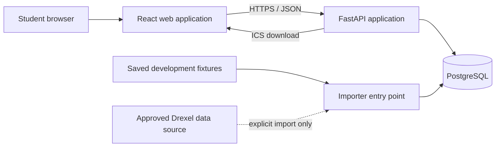

# Drexel Schedule Generator — Architecture

## 1. Architectural approach

The application will begin as a modular monolith in a monorepo. The browser frontend, backend API, importer process, and PostgreSQL database have clear boundaries, but the backend and importer share one Python codebase.

This shape is intentionally simple for a single developer:

- One frontend application
- One backend application
- One PostgreSQL database
- One separately invoked importer entry point
- No account service, queue, cache, or search cluster
- No deployment work until the local product works end to end

## 2. Technology choices

| Area | Choice | Responsibility |
| --- | --- | --- |
| Frontend | React, Vite, TypeScript | Course selection, filters, results, weekly calendar, export initiation |
| Backend | FastAPI, Python | Query API, validation, schedule generation and ranking, ICS generation |
| Persistence | PostgreSQL | Terms, course data, section relationships, meetings, import history |
| ORM and migrations | SQLAlchemy, Alembic | Data access and versioned schema changes |
| Backend tests | Pytest | Domain, API, persistence, and importer tests |
| Frontend tests | Vitest, React Testing Library | Component behavior and user workflows |
| Local runtime | Docker Compose | Reproducible database and application services |
| Future deployment | Cloud Run and Cloud Run Jobs | API service and independent updater, after local completion |
| Future automation | GitHub Actions | CI first; deployment automation only after local completion |

## 3. System context

During normal development and automated testing, the importer reads saved fixtures. Access to the live source is explicit and infrequent, not part of application startup or routine test execution.

## 4. Runtime components

### 4.1 React web application

The frontend owns presentation and temporary planner state. Its responsibilities are:

- Selecting an academic term
- Searching and displaying courses
- Selecting courses and acceptable component sections
- Collecting day/time filters and ranking preferences
- Requesting generated schedules
- Rendering schedules on a weekly calendar and as text
- Requesting an ICS download
- Displaying data freshness and source limitations
- Handling loading, empty, validation, and error states

The frontend must not reimplement authoritative scheduling rules. It may perform immediate form validation, but the backend validates every generation request and determines schedule validity.

Planner state remains anonymous. Persistence, if enabled, is limited to local storage or URL state.

### 4.2 FastAPI application

The API is a modular monolith with these internal areas:

- `api`: HTTP routing, dependency wiring, and response mapping
- `schemas`: validated API request and response contracts
- `domain`: scheduling concepts and pure rules
- `services`: application workflows such as search, generation, ranking, and export
- `repositories`: database queries and persistence operations
- `db`: SQLAlchemy models, sessions, and transaction management
- `importer`: source adapters, normalization, validation, and publication

Route handlers should remain thin. They validate transport-level input, call application services, and map results to response schemas. Scheduling and ranking logic should be pure Python wherever practical so it can be tested without HTTP or a database.

Initial API capabilities are expected to include:

- Health/readiness
- Term listing
- Course search scoped to a term
- Course detail with sections and meetings
- Data freshness
- Schedule generation
- ICS export

Exact routes and schemas will be designed alongside their implementation rather than fixed prematurely in this document.

### 4.3 PostgreSQL

PostgreSQL is the system of record for imported course data. Generated schedules are derived from requests and are not persisted in the MVP.

Initial entities are:

| Entity | Purpose |
| --- | --- |
| `academic_terms` | External term identity, display dates, and published-import reference |
| `subjects` | Subject code and name |
| `courses` | Catalog identity such as CS 171 |
| `course_offerings` | A course offered in a particular term |
| `sections` | Registerable section/component records |
| `section_relationships` | Known compatible or required links among components |
| `meeting_patterns` | Time, date range, delivery, and location for a section meeting |
| `meeting_days` | Normalized weekdays associated with a meeting pattern |
| `instructors` | Instructor identity from the source, when available |
| `section_instructors` | Section-to-instructor association |
| `data_imports` | Import status, source metadata, counts, timestamps, and errors |

Important modeling principles:

- Preserve stable source identifiers and useful raw values alongside normalized fields.
- Separate catalog courses from term-specific offerings.
- Allow a section to have zero or many meeting patterns.
- Represent asynchronous and arranged meetings explicitly rather than inventing times.
- Model known component relationships; do not infer universal lecture/lab compatibility without evidence.
- Make publication of a new term dataset atomic.

The final columns and constraints depend on representative source fixtures and will be captured in Alembic migrations when implementation begins.

### 4.4 Importer process

The importer is a separate process/entry point, not a public API endpoint. It shares database models, configuration, and domain types with the API.

Its pipeline is:

1. Start an import record.
2. Read an explicitly selected source: normally a saved fixture in development, or the approved live adapter when manually requested.
3. Parse and normalize source records.
4. Validate required fields, relationships, and record counts.
5. Load data into staging or an isolated import version.
6. Publish the new dataset atomically only after validation succeeds.
7. Record completion counts and timestamp.
8. On failure, record the error and leave the last known-good dataset published.

Importer tests must use saved, deterministic, sanitized fixtures. They must not depend on network access or repeatedly call the live source.

## 5. Schedule-generation design

### 5.1 Inputs

A generation request contains:

- Academic term
- Selected courses
- Acceptable section IDs grouped by required component
- Excluded weekdays
- Earliest allowed start time
- Latest allowed end time
- A predefined ranking mode

The backend validates that referenced terms, offerings, sections, and relationships are consistent.

### 5.2 Generation algorithm

The initial implementation should use bounded backtracking:

1. Resolve each course into valid component/section choices.
2. Apply section exclusions and hard day/time filters before combination.
3. Order choice groups by fewest valid candidates first.
4. Add one candidate at a time.
5. Reject a partial schedule as soon as it creates a time conflict or violates a relationship.
6. Record a result when every required group has been satisfied.
7. Stop at configured exploration and result limits.

This avoids building the full Cartesian product in memory. A queue or distributed worker is not justified unless measured local workloads demonstrate the need.

### 5.3 Conflict semantics

- Two timed meetings conflict when their active date ranges overlap, they share a weekday, and their half-open time intervals overlap.
- Adjacent meetings, where one ends exactly when another starts, are not time conflicts in the MVP.
- Asynchronous meetings do not create time conflicts.
- Arranged meetings are flagged as unknown-time obligations and are not treated as confirmed timed conflicts.
- Travel time between buildings is not considered in the MVP.

### 5.4 Ranking semantics

Ranking is deterministic and calculated after validity is established. The default sort order is:

1. Fewer weekdays containing in-person timed meetings
2. Less total gap time between meetings on those days
3. A stable tie-breaker based on section identifiers

Alternate predefined modes may use earliest start or earliest finish. Arbitrary user-defined weights are outside the MVP.

## 6. ICS generation

ICS files are generated on demand and are not stored. Recurring events use term and meeting date ranges with the `America/New_York` time zone. The export service must:

- Create stable event identifiers within one generated file
- Include course, section/component, and available location data
- Represent recurring weekdays correctly
- Avoid inventing times for asynchronous meetings
- Apply the approved policy for arranged meetings
- Escape ICS content safely

ICS behavior requires dedicated tests for multiple weekdays, term boundaries, and daylight-saving transitions.

## 7. Local development architecture

Docker Compose will provide a reproducible local PostgreSQL instance and may run the API and frontend once those applications exist. The desired developer workflow is:

1. Start local services.
2. Apply Alembic migrations.
3. Load a saved fixture through the importer.
4. Run the API and frontend.
5. Run backend and frontend test suites without external network dependencies.

Configuration is supplied through environment variables documented in `.env.example`. Secrets and machine-specific configuration must not be committed.

## 8. Testing strategy

### Backend

- Pure unit tests for time overlap, component compatibility, generation, metrics, and ranking
- Importer tests using saved fixtures
- Repository and migration integration tests against PostgreSQL
- API tests for validation, success, no-results, and error behavior
- ICS parsing tests that validate generated calendar structure

### Frontend

- Component and interaction tests using Vitest and React Testing Library
- Mocked API tests for term selection, search, planner changes, filters, and result navigation
- Accessibility assertions for core controls and status messages
- A small number of end-to-end tests may be added after the local primary journey works; the tool choice is deferred

Tests should emphasize behavior and domain correctness over implementation details.

## 9. Data-source safety

- The live source adapter must be isolated behind an importer interface.
- Automated tests and routine development must use saved fixtures.
- Live access must require an explicit command and must not occur at application startup.
- Source terms, permission, rate limits, and redistribution constraints must be investigated and documented before live importing is considered complete.
- Fixture files must contain only data the project is allowed to store in the repository.
- The project should retain a small synthetic fixture option so demonstrations do not depend on source availability.

## 10. Future deployment boundary

Deployment is intentionally deferred. After the application works locally, the anticipated production shape is:

- Static hosting for the Vite frontend
- FastAPI as a Google Cloud Run service
- PostgreSQL in a managed service such as Cloud SQL
- Importer as a separate Cloud Run Job
- GitHub Actions for CI/CD

These are future boundaries, not authorization to create cloud configuration now. Local correctness and usability are prerequisites for all deployment work.

## 11. Key architecture risks

| Risk | Planned response |
| --- | --- |
| Live source is unstable or disallows use | Isolate adapter, verify permission, retain fixture/demo mode |
| Component relationships are incomplete | Preserve relationships, expose uncertainty, avoid false validity claims |
| Combinatorial schedule growth | Early filtering, smallest-domain-first backtracking, strict limits |
| Inconsistent import publishes partial data | Staging/versioning and atomic publication |
| Complex meeting time semantics | Explicit date ranges, weekdays, local times, and meeting status |
| Stale availability appears authoritative | Prominent timestamps and disclaimer; optionally omit seat data |
| Architecture expands too early | Modular monolith and evidence-based additions only |

## 12. Architecture decisions still open

The following decisions should be made when their implementation phase begins:

1. Whether importer publication uses staging tables, import-version foreign keys, or a schema swap.
2. Whether the frontend uses a hand-written API client or one generated from the OpenAPI schema.
3. Which weekly-calendar library to use, if any, after evaluating accessibility and bundle cost.
4. Whether end-to-end browser tests are added and which runner is used.
5. The maximum selected-course count, search-space limit, and returned-result count, based on fixture benchmarks.

